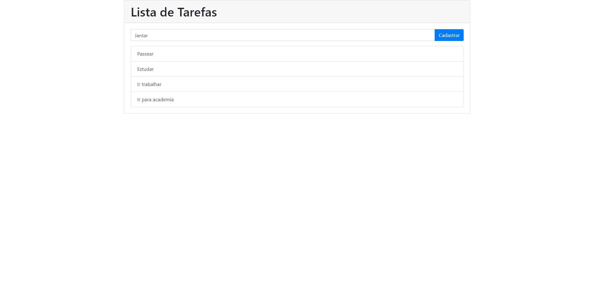

# :blue_book: Lista de tarefas

## Sobre o projeto

---

Aplicação simples de lista de tarefas para praticar a manipulação do DOM.

## O que faz a aplicação
---
* Adicionar tarefa
* Remover tarefa
* Armazena no banco de dados local "Storage"
* Ao recarregar a página mantera dados da lista

